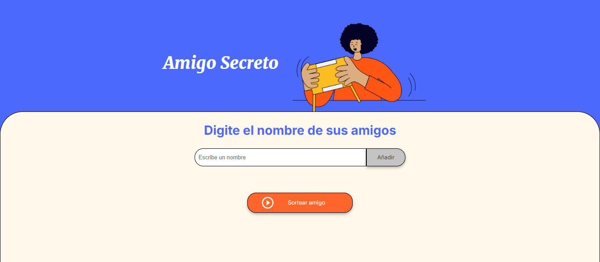
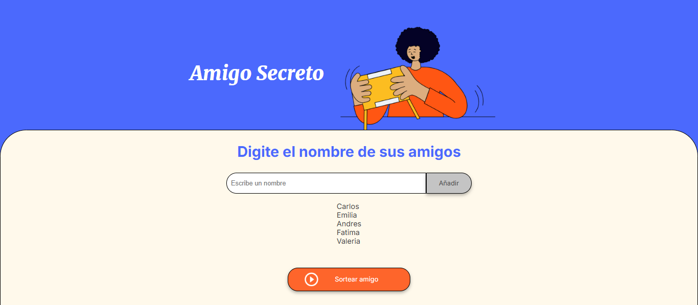
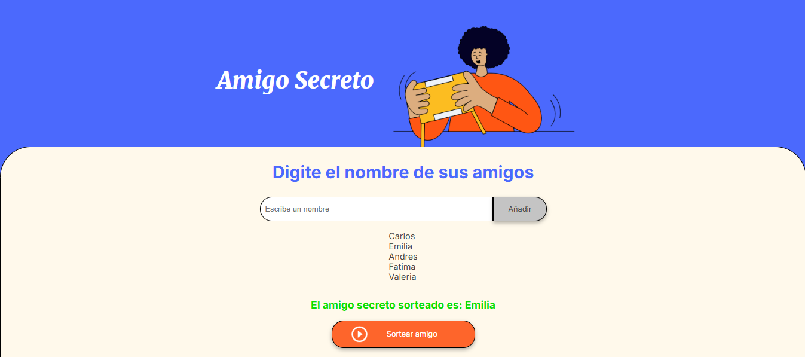

# Challenge Amigo Secreto

Aplicación interactiva diseñada como parte del programa de **Oracle Next Education**. Esta herramienta permite realizar asignaciones aleatorias de forma rápida y sencilla.

## Tabla de Contenidos

- [Características](#características)
- [Tecnologías Utilizadas](#tecnologías-utilizadas)
- [Instalación y Uso](#instalación-y-uso)
- [Capturas de Pantalla](#capturas-de-pantalla)

---

## Características

- **Sorteo Aleatorio:** Asigna amigos secretos de forma completamente aleatoria.
- **Gestión de Participantes:** Permite añadir nuevos elementos a la lista de participantes.
- **Privacidad Garantizada:** Los resultados del sorteo se revelan solo al usuario correspondiente.
- **Aplicación Web Responsive:** Funciona en cualquier dispositivo, ya sea computadora, tablet o móvil.

---

## Tecnologías Utilizadas

- **HTML y CSS:** Para el diseño de la interfaz.
- **JavaScript:** Lenguaje principal para la lógica del proyecto.

---

## Instalación y Uso

1. Clona este repositorio:

   ```bash
   git clone https://github.com/lucas29951/secretfriend-challenge.git
2. Navega al directorio del proyecto:

    ```bash
    cd secretfriend-challenge
3. Abre el archivo `index.html` en tu navegador para visualizar la aplicacion.

## Capturas de Pantalla

1. **Vista Inicial**


2. **Listado de Amigos**


3. **Sorteo Realizado**

